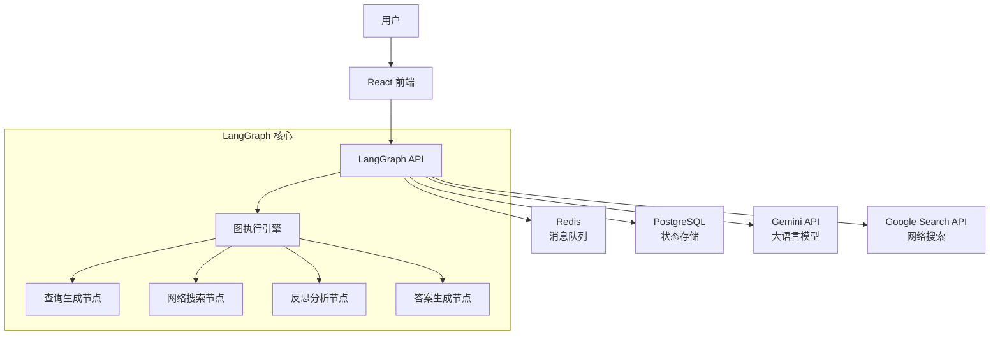
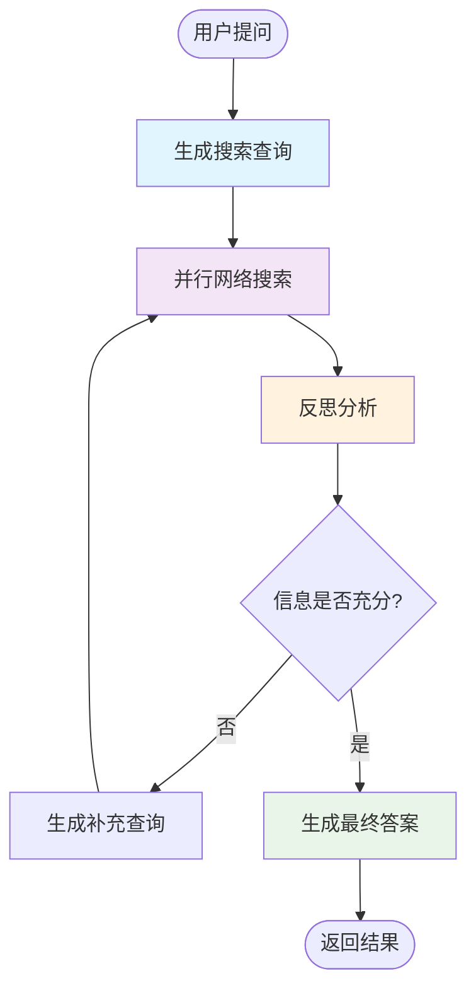
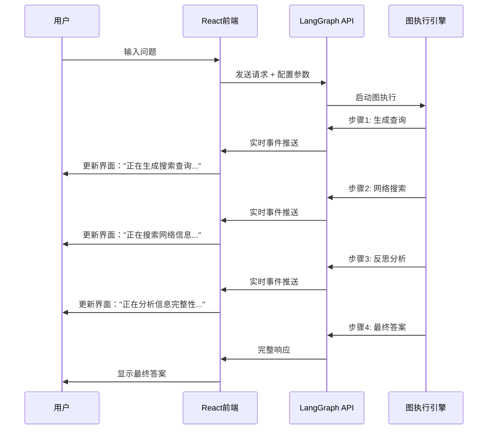

# LangGraph 项目深度解析指南

> 一份面向初学者的 LangGraph 全栈 AI 研究代理项目完整解析

## 📚 目录

1. [什么是 LangGraph？](#什么是-langgraph)
2. [项目整体架构](#项目整体架构)
3. [LangGraph 核心概念详解](#langgraph-核心概念详解)
4. [项目工作流程解析](#项目工作流程解析)
5. [代码文件结构详解](#代码文件结构详解)
6. [前端与后端交互机制](#前端与后端交互机制)
7. [实际运行示例](#实际运行示例)
8. [如何扩展和定制](#如何扩展和定制)

---

## 什么是 LangGraph？

### 基础概念

**LangGraph** 是一个专门用于构建多步骤、状态化 AI 应用的框架。你可以把它想象成：

- 🔄 **工作流引擎**: 像流水线一样，让 AI 执行一系列有序的步骤
- 🧠 **状态管理器**: 在每个步骤之间保存和传递信息
- 🌐 **图形结构**: 用节点和边来描述复杂的逻辑流程

### 为什么需要 LangGraph？

普通的 AI 对话是一问一答，但复杂任务需要多个步骤：

```
用户问题: "分析一下苹果公司的最新财报"

传统AI: 直接给出可能过时或不准确的答案

LangGraph AI: 
Step 1: 生成搜索关键词 → "苹果公司 Q3财报 2024"
Step 2: 网络搜索收集信息 → 找到官方财报数据
Step 3: 分析信息充分性 → 判断是否需要更多信息
Step 4: 继续搜索补充 → 搜索分析师评论
Step 5: 综合生成报告 → 输出完整分析
```

这就是 LangGraph 的价值 - **让 AI 像人类专家一样分步思考和行动**。

---

## 项目整体架构

### 系统架构图



### 技术栈详解

| 层级 | 技术 | 作用 |
|------|------|------|
| **前端界面** | React + TypeScript + Tailwind CSS | 用户交互界面，实时显示 AI 思考过程 |
| **后端核心** | LangGraph + FastAPI | AI 工作流引擎，处理复杂推理逻辑 |
| **AI 模型** | Google Gemini 2.0/2.5 | 自然语言理解和生成 |
| **外部服务** | Google Search API | 获取实时网络信息 |
| **数据存储** | PostgreSQL + Redis | 持久化状态和实时消息传递 |
| **部署** | Docker + Docker Compose | 容器化部署，简化环境配置 |

---

## LangGraph 核心概念详解

### 1. 状态（State）

**状态就像是一个信息传递的容器**，在不同步骤之间携带数据。

```python
# 想象这是一个正在填写的调研报告
class OverallState(TypedDict):
    messages: list          # 用户的问题和AI的回答
    search_query: list      # 生成的搜索关键词
    web_research_result: list  # 搜索到的信息
    sources_gathered: list  # 收集的信息来源
    research_loop_count: int   # 已经研究了几轮
```

**类比理解**: 就像一个不断更新的文件夹，每个步骤都会往里面添加新信息。

### 2. 节点（Nodes）

**节点就是具体的工作步骤**，每个节点负责一个特定任务。

```python
def generate_query(state):
    """第一步：根据用户问题生成搜索关键词"""
    # 输入：用户的问题
    # 输出：搜索关键词列表
    
def web_research(state):
    """第二步：使用搜索关键词查找信息"""
    # 输入：搜索关键词
    # 输出：搜索结果和来源
    
def reflection(state):
    """第三步：分析信息是否充分"""
    # 输入：已收集的信息
    # 输出：是否需要继续搜索的判断
```

### 3. 边（Edges）

**边定义了节点之间的连接关系**，控制执行流程。

```python
# 简单的顺序连接
builder.add_edge("generate_query", "web_research")

# 条件分支连接
builder.add_conditional_edges(
    "reflection", 
    evaluate_research,  # 判断函数
    ["web_research", "finalize_answer"]  # 可能的下一步
)
```

### 4. 图（Graph）

**图是整个工作流的蓝图**，定义了完整的执行路径。

```python
# 构建工作流图
builder = StateGraph(OverallState)
builder.add_node("step1", function1)
builder.add_node("step2", function2)
builder.add_edge("step1", "step2")
graph = builder.compile()
```

---

## 项目工作流程解析

### 完整流程图



### 详细步骤解析

#### 步骤 1: 查询生成（generate_query）

**目的**: 将用户的自然语言问题转换为有效的搜索关键词

```python
# 用户输入: "最近有什么新的AI技术突破？"
# 
# AI分析思考过程:
# 1. 这个问题很宽泛，需要分解
# 2. "最近"指的是什么时间范围？
# 3. "AI技术突破"可能包括哪些领域？
# 
# 生成的搜索查询:
[
    "AI breakthrough 2024 latest developments",
    "machine learning advances recent months",
    "generative AI new models 2024"
]
```

**关键技术**:
- 使用 Gemini 模型进行查询扩展
- 结构化输出确保查询格式正确
- 考虑时间敏感性和查询多样性

#### 步骤 2: 网络搜索（web_research）

**目的**: 并行执行多个搜索，收集相关信息

```python
# 并行搜索示例:
# 
# 查询1: "AI breakthrough 2024" 
# → 找到: GPT-4、Claude-3、Gemini相关新闻
#
# 查询2: "machine learning advances"
# → 找到: 新的模型架构、训练技术改进
#
# 查询3: "generative AI new models"  
# → 找到: 图像生成、代码生成新进展
```

**技术亮点**:
- 使用 Google Search API 获取实时信息
- 自动解析搜索结果和提取关键信息
- 智能引用管理，为每个信息片段标记来源

#### 步骤 3: 反思分析（reflection）

**目的**: 评估已收集信息的完整性，决定是否需要更多研究

```python
# AI的反思过程:
# 
# 已有信息分析:
# ✅ 找到了最新的AI模型发布信息
# ✅ 有具体的技术突破案例
# ❌ 缺少学术界的最新研究
# ❌ 没有涉及AI安全方面的进展
# 
# 决策: 需要补充搜索
# 
# 生成补充查询:
# - "AI safety research 2024"
# - "academic AI papers recent breakthrough"
```

**智能判断**:
- 识别信息缺口和不平衡
- 生成有针对性的补充查询
- 控制搜索深度，避免无限循环

#### 步骤 4: 最终答案生成（finalize_answer）

**目的**: 整合所有信息，生成结构化的完整回答

```markdown
# 生成的最终答案示例:

## 2024年最新AI技术突破

### 大语言模型领域
- **GPT-4 Turbo**: 更长上下文窗口 [来源](...)
- **Gemini Ultra**: 多模态能力突破 [来源](...)

### 计算机视觉
- **DALL-E 3**: 图像生成质量提升 [来源](...)

### 学术研究
- **Transformer架构改进**: 效率提升40% [来源](...)

*基于以上8个可靠来源整理*
```

---

## 代码文件结构详解

### 后端核心文件

```
backend/src/agent/
├── graph.py           # 🎯 核心工作流定义
├── state.py           # 📊 状态管理和数据结构
├── prompts.py         # 💬 AI提示词工程
├── tools_and_schemas.py # 🔧 工具和数据模型
├── configuration.py   # ⚙️ 配置管理
├── utils.py           # 🛠️ 辅助工具函数
└── app.py            # 🚀 FastAPI应用入口
```

#### 1. graph.py - 工作流的大脑

```python
# 这个文件定义了整个AI的"思考流程"
# 就像给AI制定了一套标准作业程序(SOP)

def generate_query(state):
    """第一步：思考应该搜索什么"""
    
def web_research(state): 
    """第二步：去网上找信息"""
    
def reflection(state):
    """第三步：反思信息是否够用"""
    
def finalize_answer(state):
    """第四步：写出最终报告"""

# 把这些步骤连接起来
builder.add_edge("generate_query", "web_research")
builder.add_edge("web_research", "reflection")
# ... 更多连接
```

#### 2. state.py - 信息的载体

```python
# 定义了在整个过程中需要记住的信息
class OverallState(TypedDict):
    messages: list              # 对话历史
    search_query: list          # 搜索关键词
    web_research_result: list   # 搜索结果
    sources_gathered: list      # 信息来源
    # ... 更多状态信息
```

#### 3. prompts.py - AI的行动指南

```python
# 这里存放了给AI的详细指令
# 就像给人类员工写的工作手册

query_writer_instructions = """
你的任务是生成高质量的搜索查询词...
- 要考虑时效性
- 要保证查询的多样性  
- 不要生成重复的查询
"""

web_searcher_instructions = """
进行有针对性的Google搜索...
- 寻找最新、可信的信息
- 仔细跟踪每个信息的来源
"""
```

### 前端核心文件

```
frontend/src/
├── App.tsx                    # 🎪 主应用组件
├── components/
│   ├── ChatMessagesView.tsx   # 💬 聊天界面
│   ├── ActivityTimeline.tsx   # ⏱️ 实时进度显示
│   ├── WelcomeScreen.tsx      # 👋 欢迎页面
│   └── InputForm.tsx          # 📝 输入表单
└── lib/utils.ts              # 🔧 前端工具函数
```

#### 1. App.tsx - 前端的指挥中心

```typescript
// 这个组件负责：
// 1. 与LangGraph后端建立连接
// 2. 管理整个应用的状态
// 3. 处理用户输入和AI响应

const thread = useStream({
    apiUrl: "http://localhost:2024",  // 后端地址
    assistantId: "agent",             // AI代理ID
    onUpdateEvent: (event) => {       // 实时接收AI的工作进展
        // 当AI开始生成查询时...
        // 当AI开始搜索时...
        // 当AI在反思时...
    }
});
```

#### 2. ActivityTimeline.tsx - AI思考的可视化

```typescript
// 这个组件实时显示AI的工作进展
// 用户可以看到AI正在做什么

<ActivityTimeline 
    processedEvents={[
        { title: "生成搜索查询", data: "AI技术突破, 机器学习进展" },
        { title: "网络搜索", data: "收集了15个信息源" },
        { title: "反思分析", data: "分析搜索结果完整性" },
        { title: "生成答案", data: "整合信息并撰写报告" }
    ]}
    isLoading={true}
/>
```

---

## 前端与后端交互机制

### 实时通信流程



### 关键交互代码

#### 前端发送请求

```typescript
// 用户提交问题时
const handleSubmit = (question: string, effort: string, model: string) => {
    // 根据努力程度设置搜索参数
    let searchQueries = effort === "high" ? 5 : 3;
    let maxLoops = effort === "high" ? 10 : 3;
    
    // 发送给LangGraph
    thread.submit({
        messages: [{ type: "human", content: question }],
        initial_search_query_count: searchQueries,
        max_research_loops: maxLoops,
        reasoning_model: model
    });
};
```

#### 后端实时反馈

```python
# LangGraph自动发送执行事件
def web_research(state, config):
    # 执行搜索逻辑...
    results = search_web(state["search_query"])
    
    # LangGraph会自动将这个事件发送到前端
    return {
        "web_research_result": results,
        "sources_gathered": sources
    }
```

---

## 实际运行示例

### 示例问题：分析最新的电动汽车市场趋势

#### 1. 用户输入
```
问题：2024年电动汽车市场有什么新的发展趋势？
努力程度：高
模型：gemini-2.5-pro
```

#### 2. AI执行过程

**Step 1: 生成搜索查询**
```
🔍 生成搜索查询
- "electric vehicle market trends 2024"
- "EV sales growth statistics 2024" 
- "electric car technology breakthrough 2024"
- "Tesla BYD market share 2024"
- "EV charging infrastructure development"
```

**Step 2: 并行网络搜索**
```
🌐 网络搜索 (并行执行5个查询)
- 收集了28个信息源
- 相关话题：销量数据、新车型、政策支持、技术创新
```

**Step 3: 反思分析**
```
🧠 反思分析
发现知识缺口：
- 缺少中国市场的具体数据
- 需要更多关于电池技术进展的信息

生成补充查询：
- "China EV market share 2024 BYD"
- "lithium battery technology advances 2024"
```

**Step 4: 继续搜索**
```
🌐 补充搜索
- 收集了额外15个信息源
- 补充了中国市场和电池技术信息
```

**Step 5: 生成最终答案**
```
📄 生成最终答案
整合43个信息源，生成结构化报告...
```

#### 3. 最终输出示例

```markdown
# 2024年电动汽车市场发展趋势分析

## 📊 市场规模与增长

2024年全球电动汽车销量预计将达到1420万辆，同比增长35% [AutoNews](https://...)。
中国仍是最大市场，占全球销量的60% [Bloomberg](https://...)。

## 🚗 主要厂商表现

### 特斯拉 (Tesla)
- 全球交付量：180万辆 (+25%) [Tesla IR](https://...)
- Model Y成为全球最畅销电动车 [Reuters](https://...)

### 比亚迪 (BYD)  
- 中国市场份额：35% (+8%) [中汽协](https://...)
- 刀片电池技术获得重大突破 [BYD官网](https://...)

## 🔋 技术创新亮点

### 电池技术
- **固态电池**: 丰田宣布2025年量产 [Toyota News](https://...)
- **4680电池**: 特斯拉成本降低14% [Electrek](https://...)

### 充电技术
- **800V快充**: 保时捷、现代普及应用 [InsideEVs](https://...)
- **无线充电**: 宝马试点项目启动 [BMW Group](https://...)

## 🏛️ 政策环境

- 美国《通胀削减法案》刺激本土产业 [US Gov](https://...)
- 欧盟2035年燃油车禁售令推进 [EU Council](https://...)
- 中国双积分政策继续加码 [工信部](https://...)

## 🔮 未来展望

预计2025年电动汽车渗透率将达到30%，自动驾驶功能将成为标配。
充电基础设施建设将是决定市场发展速度的关键因素。

---
*本报告基于43个权威信息源分析整理，数据截至2024年12月*
```

---

## 如何扩展和定制

### 1. 添加新的研究步骤

想要增加一个"专家意见收集"步骤？

```python
# 1. 在 state.py 中添加新的状态字段
class OverallState(TypedDict):
    # ... 现有字段
    expert_opinions: Annotated[list, operator.add]  # 新增

# 2. 在 graph.py 中添加新节点
def collect_expert_opinions(state: OverallState, config: RunnableConfig):
    """收集专家意见和分析报告"""
    # 搜索学术论文、专家访谈、分析师报告
    # ...
    return {"expert_opinions": opinions}

# 3. 将新节点加入工作流
builder.add_node("collect_experts", collect_expert_opinions)
builder.add_edge("reflection", "collect_experts")
builder.add_edge("collect_experts", "finalize_answer")
```

### 2. 支持不同类型的研究

想要支持图片搜索和分析？

```python
# 添加多模态搜索节点
def image_research(state: OverallState, config: RunnableConfig):
    """搜索和分析相关图片"""
    # 使用 Google Images API
    # 用 Gemini Vision 分析图片内容
    # ...
    return {"image_analysis": results}
```

### 3. 定制不同的AI角色

想要创建专门的金融分析师AI？

```python
# 在 prompts.py 中添加专业提示词
financial_analyst_instructions = """
你是一位资深金融分析师，专门分析：
- 财务报表和关键指标
- 市场趋势和竞争格局  
- 投资风险和机会评估
- 行业前景和政策影响

请以专业、客观的角度进行分析...
"""

# 在 configuration.py 中添加角色配置
class Configuration(BaseModel):
    analyst_type: str = Field(
        default="general",
        metadata={"description": "分析师类型：general, financial, technical, market"}
    )
```

### 4. 增强前端交互

想要添加更丰富的可视化？

```typescript
// 新增图表组件
const DataVisualization = ({ data }: { data: ResearchData }) => {
    return (
        <div className="grid grid-cols-2 gap-4">
            <TrendChart data={data.trends} />
            <SourceDistribution data={data.sources} />
            <TimelineView events={data.timeline} />
            <KeywordsCloud words={data.keywords} />
        </div>
    );
};
```

### 5. 集成其他AI模型

想要支持 Claude 或 GPT？

```python
# 在 configuration.py 中扩展模型选项
class Configuration(BaseModel):
    query_generator_model: str = Field(
        default="gemini-2.0-flash",
        metadata={
            "description": "可选：gemini-2.0-flash, claude-3-sonnet, gpt-4-turbo"
        }
    )

# 在 graph.py 中添加模型工厂
def create_llm(model_name: str, config: dict):
    if model_name.startswith("gemini"):
        return ChatGoogleGenerativeAI(model=model_name, **config)
    elif model_name.startswith("claude"):
        return ChatAnthropic(model=model_name, **config)
    elif model_name.startswith("gpt"):
        return ChatOpenAI(model=model_name, **config)
```

---

## 总结

这个 LangGraph 项目展示了如何构建一个**智能的、多步骤的AI研究助手**。通过学习这个项目，你将掌握：

### 🎯 核心技能
- **LangGraph框架使用**: 理解状态管理、节点设计、流程控制
- **提示词工程**: 设计有效的AI指令和引导词
- **多模态AI集成**: 结合搜索、分析、生成等多种AI能力
- **全栈开发**: React前端 + Python后端的完整架构

### 🚀 实践价值
- **可复用架构**: 这套架构可以应用到各种复杂AI任务
- **生产级质量**: 包含错误处理、状态持久化、实时通信
- **高度可扩展**: 易于添加新功能和集成其他服务

### 🌟 学习建议

1. **从简单开始**: 先运行项目，观察AI的执行过程
2. **修改提示词**: 尝试调整 prompts.py 中的指令，看看效果变化
3. **添加新节点**: 实践新增一个简单的处理步骤
4. **定制界面**: 修改前端组件，增加自己的功能
5. **部署实践**: 使用Docker部署到云服务器

通过深入理解这个项目，你就掌握了构建复杂AI应用的核心技能！

---

*🎉 恭喜你完成了 LangGraph 项目的深度学习！现在是时候开始你自己的AI项目了！* 